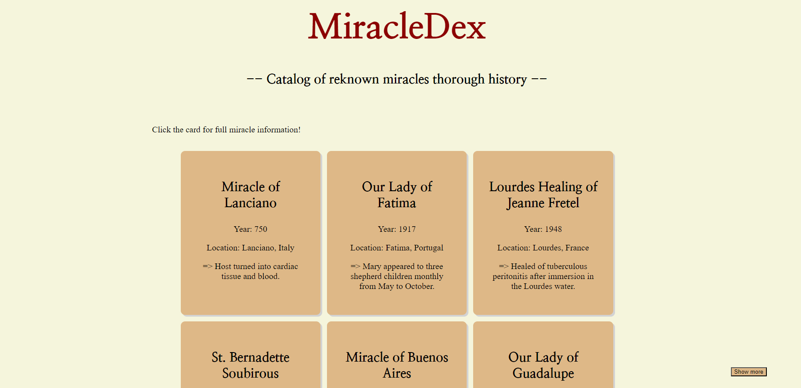
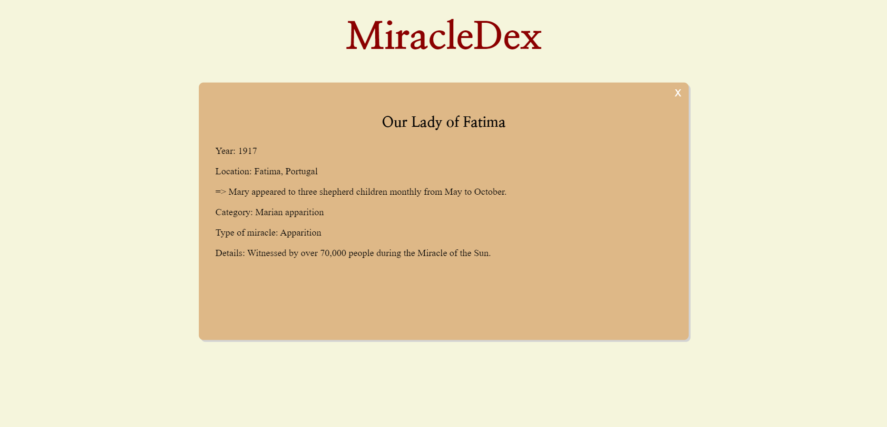

## The MiracleDex
A catalog of Catholic miracles.

## Description 
*MiracleDex* is a website that presents some real Catholic miracles.
These miracles include Eucharistic miracles, Marian apparitions, incorruptible saints, and more.
This project is inspired by the works done by **Blessed Carlo Acutis** during his life on earth.

## Features
- Presents originally 6 miracle cards.
- Once a card clicked, it gives you more detailed information about the specific miracles.
- If the button is pressed, more cards will be dynamically uploaded.
- If all the cards are presented, the button disappears. 

## Code
- HTML
- CSS
- JavaScript

## Setup instructions
1. Clone the repo [link to repo](https://github.com/celeste2g/Projet1.git)
2. Run `npm install`
3. Start the server with `npm start`

## Live site link

## Screenshots
The Home page

A miracle card

## Licence 
MIT

